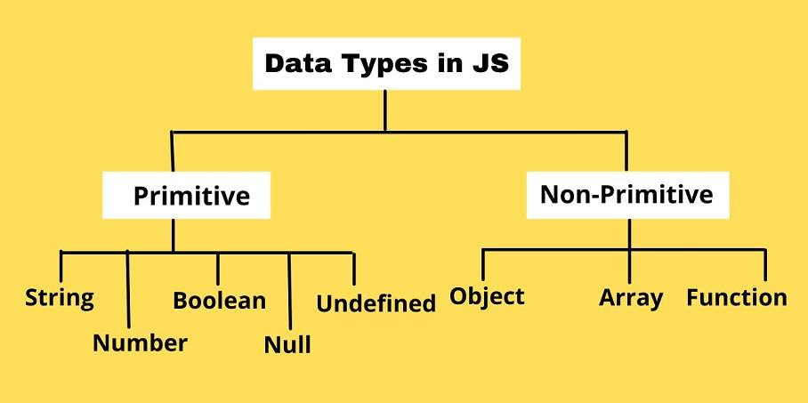

##  JavaScript Practice
### __Basic JavaScript:__
---

### Q:1 জাভাস্ক্রিপ্ট কি জিনিস এইটা কি জানো?

<p>JavaScript is a high-level, often just-in-time compiled language that conforms to the ECMAScript standard.It has dynamic typing, prototype-based object-orientation, and first-class functions. It is multi-paradigm, supporting event-driven, functional, and imperative programming styles. It has application programming interfaces (APIs) for working with text, dates, regular expressions, standard data structures, and the Document Object Model (DOM). </p>

### Q:2 জাভাস্ক্রিপ্ট কিভাবে কাজ করে সেটা কি জানো?
<p>JS is a single threaded and single concurrent programming language which means it can handle one task at a time or, in other words, a piece of code at a time. It’s an interpreted programming language, and like most scripting languages, it uses dynamic typing, where type safety is verified at the runtime. JS is considered a lightweight programming language and one of the many reasons is that it does not have any variable types, unlike other languages. It has a very small memory footprint and is easily implemented. This is important especially for porting.</p>

### Q:3 ভেরিয়েবল কি জিনিস?
<p>Js variables are containers for storing data. In another defination A JavaScript variable is simply a name of storage location.</p>

### Q:4 ভেরিয়েবল কিভাবে ডিক্লেয়ার করে? 

#### __We need 5 things to declare a variables:__ 

``` js
var courseName = "Web Development";
let age = 95;
const name = "Mohon Saha";

```

 1. Keyword
 2. Variable name
 3. Assignment operator(=)
 4. Value
 5. Semicolon

<p>

 - Variables can be defined using let keyword. Variables defined without let or var keyword become global variables.
 - Variables should be initialized before accessing it. Unassigned variable has value undefined.
 - JavaScript is a loosely-typed language, so a variable can store any type value.
 - Variables can have local or global scope. Local variables cannot be accessed out of the function where they are declared, whereas the global variables can be accessed from anywhere.</p>

 ### Q:5 ভেরিয়েবল এর মান কিভাবে চেইঞ্জ করে বা আপডেট করে।

 ```js
var x = 95;
x = 900;
console.log(x);
// new value of x is 900 
 ```


 ### Q:6 কি কি ধরণের ভেরিয়েবল হয়।

 - String
 - Number
 - Booleans
 - Arrays
 - Objects
 - Undefined

 ### Q:7 জাভাস্ক্রিপ এ primitive and non primitive data types কি কি ? উদাহরণ হিসেবে বলো। 

<p> The Primitive Data types in JavaScript: 

  -  Number
  - String
  - Boolean
  -  Undefined
  -  Null
  -  Symbol

The Non-Primitive data type :
  - Object
  - Array
  - Function

  
 </p>

 ### Q:8 ভেরিয়েবল এর নাম কিভাবে কিভাবে ডিক্লেয়ার করতে হয়। কোন কোন জিনিস নাম এ লেখা যাবে না। অর্থাৎ Variable এর naming convention সম্পর্কে বলো।

 1. Variable name can not be any keywork.
 2. variable name has to be in one word. No space is suitable.
 3. Variable name can not have any quotation.
 4. Varuable name can not starts with a number but it can ends with a numkber.

 ```js
var const = 99;  // It's Wrong
var my name = "Mohon Saha"; // It's Wrong
var "jharkar vai" = "Ki ase jibone";  // It's Wrong
var 99club = 989; // It's Wrong

 ```

 <p> How we can use long name: </p>
 
 - Use Underscore
 - Use camelcase

 ```js
 let myName = "Mohon Saha"  // Currect
 const jhankar_vai = "Ki ase jibone"  // Currect
 var club95 = 98; // Currect

 ```

 ### Q:9  দুইটা ভেরিয়েবল এর মধ্যে =, -, *, /, % কিভাবে করে? 

 ```js

var x = 3;
var y = 4;
var substraction = y - x;  // Output: 1
var multiplication = x * y: // Output: 12
var division = y / x; // Output: 1.3333333333333333
var modulas = y % x; // Output: 1

 ```

 ### Q:10 শর্টহ্যান্ড গুলো জানতে হবে। বিশেষ করে +=, -=, *=, /= জানতে হবে।

  ```js

var x = 3;
var y = 4;
y -= x; // Output: 1
y += x; // Output: 7
y *= x; // Output: 12
y /= x; // Output: 1.3333333333333333
 ```

### Q:11 ++ এবং -- এর কাজ কি ? এইটা কি জানো। 

<p>++ : We use it to increment 1 from the previous value. </p>
<p>-- : We use it to decreaemnt 1 from the previous value. </p>

```js
var x = 3;
var y = 4;
x++;        // Now the value of x is 4
y--;        // Now the value of y is 3
```

### Q:12 parseInt, parseFloat, toFixed এইগুলা কি করে? 

<p> Parseint: </p>

- Convert the value from string to integer.
- Convert the value from string to integer.

<p> Parsefloat: </p>

- Convert the value from string to float.

<p> Parsefloat: </p>

- it returns a stirng and make the float point data rounded the string to a specified number of decimals.

### Q:13 Array কি জিনিস। এইটা কিভাবে কাজ করে? কিভাবে Array ডিক্লেয়ার করতে হয়?

<p>An array is a special variable, which can hold more than one value. </p>

<p>How do arrays work? </p>

 - An array is a linear data structure that collects elements of the same data type and stores them in contiguous and adjacent memory locations. Arrays work on an index system starting from 0 to (n-1), where n is the size of the array. 

 ```js 
const cars = ["Saab", "Volvo", "BMW"];
 ```

### Q:14 array এর মধ্যে কয়টা উপাদান (element) আছে সেটা কিভাবে বের করে?

 ```js 
const fruits = ["Banana", "Orange", "Apple", "Mango"];
let length =  fruits.length;
// Output: 4
 ```

 ### Q:15 array এর উপাদান গুলা এর পজিশন ( index) কিভাবে কাজ করে। কত দিয়ে শুরু হয়। এবং মান কিভাবে চেইঞ্জ হয়। 

  ```js 
const fruits = ["Banana", "Orange", "Apple", "Mango"];

/*
Indexd Of Banana: 0
Indexd Of Orange: 1
Indexd Of Apple: 2
Indexd Of Mango: 3
*/
 ```

 ### Q:16 কোন একটা উপাদানের index এর মান -১ বলতে কি বুঝায়?

 <p> It means that element does not exist in the denote array. </p>


### Q:17  কিভাবে index দিয়ে কোন একটা array এর মধ্যে উপাদান এর মান খুঁজে বের করতে পারো?

  ```js 
const fruits = ["Banana", "Orange", "Apple", "Mango"];
const fruit1 = fruits[2];

// Output: Apple

 ```


### Q:18 কিভাবে কোন একটা index পজিশন এ array এর উপাদান এর মান চেইঞ্জ করতে পারবে ?


  ```js 
const fruits = ["Banana", "Orange", "Apple", "Mango"];
fruits[2] = "watermalon";
console.log(fruits);

// Output: [ 'Banana', 'Orange', 'watermalon', 'Mango' ]

 ```

### Q: 19 একটা Array এর মধ্যে কোন একটা উপাদান এর মান তোমাকে দেয়া আছে এখন সেটার index তুমি কিভাবে খুঁজে বের করতে পারো?


  ```js 
var scores = [10, 20, 30, 10, 40, 20];

console.log(scores.indexOf(10)); // 0
console.log(scores.indexOf(30)); // 2
console.log(scores.indexOf(50)); // -1
console.log(scores.indexOf(20)); // 1

 ```


### Q:20 ধরো, কোন একটা ইনডেক্স দিয়ে উপাদান খুঁজতে গেছো। কিন্তু সেটার মান না দিয়ে তোমাকে undefined দেখাচ্ছে। সেটা দেখে তুমি কি বুঝবে?


<p>It actually means that which index number i have provided does not contains any element.</p>

  ```js 
const fruits = ["Banana", "Orange", "Apple", "Mango"];
var result = fruits[4];
console.log(result);
// Output: undefined

 ```
 
 ### Q:21 কোন একটা Array এর মধ্যে লাস্ট উপাদান হিসেবে কোন উপাদান হিসেবে যোগ করতে চাইলে কিভাৱে যোগ করবে। আবার Array থেকে শেষের উপাদান টা বের করে দিতে চাইলে কিভাবে বের করে দিবে? 

 <p>Add a new item as the last element of an array:  </p>

   ```js 
const fruits = ["Banana", "Orange", "Apple", "Mango"];
fruits.push("watermalon");
console.log(fruits);

//Output: [ 'Banana', 'Orange', 'Apple', 'Mango', 'watermalon' ]

 ```

 <p>Remove the last element of an array:  </p>

   ```js 
const fruits = ["Banana", "Orange", "Apple", "Mango"];
fruits.pop();
console.log(fruits);

//Output: [ 'Banana', 'Orange', 'Apple' ]

 ```

### Q:22 কোন একটা Array এর মধ্যে প্রথম উপাদান হিসেবে কোন উপাদান হিসেবে যোগ করতে চাইলে কিভাৱে যোগ করবে। আবার Array থেকে প্রথম উপাদান টা বের করে দিতে চাইলে কিভাবে বের করে দিবে? 

 <p>Add a new item as the first element of an array:  </p>

   ```js 
const fruits = ["Banana", "Orange", "Apple", "Mango"];
fruits.unshift("Watermalon");
console.log(fruits);

//Output: [ 'Watermalon', 'Banana', 'Orange', 'Apple', 'Mango' ]

 ```

<p>Remove the first element of an array:  </p>

   ```js 
const fruits = ["Banana", "Orange", "Apple", "Mango"];
fruits.shift();
console.log(fruits);

//Output: [ 'Orange', 'Apple', 'Mango' ]

 ```

### Q:23 তুলনা কিভাবে করতে হয়। এইগুলার মানে কি: >, <, ==, !=, <=, >=, ===, !==, &&, ।। 

<p>Comparison operators can be used in conditional statements to compare values. </p>

 

   ```js 
   /*

 >	greater than
 <	less than
 ==	equal to
 !=	not equal
 <=	less than or equal to
 >=	greater than or equal to
 ===	equal value and equal type
 !==	not equal value or not equal type
 &&	and
 ||	or


*/
 ```


### Q:24 তোমার কাছে: ৮০০০০ টাকার বেশি হলে তুমি mac কিনবে, ৬০ হাজার টাকার বেশি হলে gaming ল্যাপটপ কিনবে, ৪০ হাজার টাকার বেশি হলে lenovo yoga কম্পিউটার কিনবে , ২০ হাজার টাকার বেশি হলে পুরান ল্যাপটপ কিনবে। না হয় তুমি মোবাইল দিয়ে কাজ চালাবে।

```js
var myBudget = 30000;
if(myBudget > 80000){
    console.log("I want to buy a mac.");
}
else if(myBudget > 60000){
 console.log("I want to buy Gaming a laptop.");
}
else if(myBudget > 40000){
 console.log("I want to buy a lenovo yoga.");
}
else if(myBudget > 20000){
 console.log("I want to buy a Second hand laptop");
}
else{
    console.log("No enough money. Let me fun with my xiaomi");
}

```

### Q:25 আসকে আমার মন ভালো নেই এই কথা ৩৯ বার আউটপুট হিসেবে দেখাও।

```js
for(var i = 0; i<39; i++){
    console.log("আসকে আমার মন ভালো নেই");
}

```


